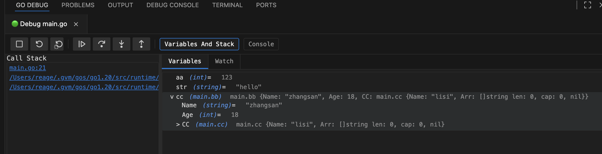

# Go Debug Pro

[English doc](./README_EN.md)


🚀 一个功能强大的 VS Code Golang 调试扩展，提供开箱即用的功能，目标提供类似 GoLand 的专业级调试体验。兼容现有 vscode 调试配置。


在左侧工作区拷贝一个 debug 选型卡，用来管理运行配置项，与 vscode 配置兼容。 
交互式配置管理: 实现管理和debug等功能。 配置项，单击编辑，hover 会出现，run 和 debug， 右击支持编辑，运行(debug)，删除
 

在 main  package 右击，会有创建配置


在底部工作区，新加一个输出tab, 用来负责console 和debug。 
包含 run/debug toolbar, console, debug(stack trace, variable, watch)


查看变量值, 调用函数, 失去焦点自动计算表达式


## 📋 目录

- [主要特性](#-主要特性)
- [快速开始](#-快速开始)
- [使用指南](#-使用指南)
- [配置选项](#️-配置选项)
- [快捷键](#-快捷键)
- [项目架构](#️-项目架构)
- [开发](#️-开发)
- [问题排查](#-问题排查)
- [贡献指南](#-贡献指南)
- [许可证](#-许可证)

## 📋 系统要求

- **VS Code**: 1.85.0 或更高版本
- **Go**: 1.19 或更高版本
- **Delve**: 最新版本 (自动检测或手动安装)
- **平台**: macOS
- **内存**: 推荐 4GB+ RAM

## ✨ 主要特性

###  智能配置管理
- **单击打开配置**：单击配置项直接打开可视化编辑器
- **右键操作菜单**：复制配置、删除配置等快捷操作
- **统一菜单整合**：清理重复菜单，提供简洁的用户界面
- **命令面板简化**：只在命令面板中显示新建配置相关命令

### � 可视化配置编辑器
- **图形化界面**：无需手写 JSON，通过可视化界面创建和编辑调试配置
- **实时预览**：配置更改实时显示，所见即所得
- **模板支持**：提供多种预设模板，快速创建不同类型的配置
- **智能验证**：自动验证配置的正确性，防止配置错误

###  高级调试功能
- **条件断点**：支持基于表达式的条件断点设置
- **Hit Count 断点**：支持命中次数控制的断点
- **实时变量监视**：监视表达式自动刷新，实时查看变量变化
- **变量编辑**：直接在调试面板修改变量值，支持字符串、数字等类型
- **完整调试支持**：Call Stack、Threads、Variables 全面支持
- **DAP 协议**：基于 Debug Adapter Protocol，确保调试稳定性
- **多会话管理**：支持同时运行多个调试配置
- **右键菜单**：丰富的变量操作菜单（复制、编辑、监视等）

### 📂 项目结构支持
- **多种运行模式**：支持单文件、包、目录、模块、工作区等运行方式
- **智能路径检测**：自动检测 go.mod 文件和 Go 包结构
- **工作区管理**：统一管理多个工作区的调试配置
- **标签页管理**：每个调试配置独立标签页，清晰管理多个调试会话
- **实时状态显示**：运行状态、持续时间等信息实时更新

## 🚀 快速开始

### 前置条件

确保已安装 [Delve](https://github.com/go-delve/delve) 调试器：

```bash
go install github.com/go-delve/delve/cmd/dlv@latest
```

### 安装扩展

1. 在 VS Code 扩展市场搜索 "Go Debug Pro"
2. 点击安装
3. 重启 VS Code（如果需要）

### 创建第一个调试配置

1. 按 `Shift + Cmd + P` 打开命令面板
2. 搜索 "Create Configuration (Visual Editor)"
3. 选择配置类型并填写参数
4. 保存配置即可开始调试

## 📖 使用指南

### 配置管理

#### 创建新配置
- **命令面板方式**：`Shift + Cmd + P` → "Create Configuration (Visual Editor)"
- **面板方式**：在调试面板点击 "Enhanced configuration" 视图的 "+" 按钮

#### 管理现有配置
- **单击配置项**：直接打开可视化编辑器
- **右键配置项**：显示操作菜单（复制、删除等）
- **实时同步**：所有更改自动同步到 `launch.json` 文件

### 调试操作

#### 设置条件断点
1. 在代码行右键
 
#### 使用监视表达式
1. 调试时切换到 "Variables And Stack" 视图
2. 点击 "Watch" 标签页
3. 输入表达式（如：`user.Name`、`len(slice)`）
4. 点击 "+" 按钮添加监视
5. 表达式值会自动刷新显示
6. 支持通过 call 调用函数

#### 变量操作
1. **查看变量**：在 Variables 标签查看所有局部变量和全局变量
2. **编辑变量值**：单击变量值直接编辑（支持字符串、数字、布尔值）
3. **右键菜单**：
   - 📋 复制变量名
   - 📄 复制变量值
   - 📝 复制表达式

#### 调用栈操作
- 点击调用栈中的函数名可跳转到对应源码位置
- 支持多线程和协程的调用栈显示

## ⚙️ 配置选项

### 扩展设置

在 VS Code 设置中搜索相关配置项：

```json
{
    "go.delveConfig": {
        "dlvLoadConfig": {
            "followPointers": true,
            "maxVariableRecurse": 1,
            "maxStringLen": 200,
            "maxArrayValues": 100,
            "maxStructFields": -1
        },
        "apiVersion": 2,
        "stackTraceDepth": 50
    }
}
```

### Launch 配置
```json
{
    "name": "Launch Go Program",
    "type": "go-debug-pro",
    "request": "launch",
    "mode": "debug",
    "program": "${workspaceFolder}/main.go",
    "cwd": "${workspaceFolder}",
    "env": {},
    "args": [],
    "stopOnEntry": false,
    "dlvFlags": ["--check-go-version=false"]
}
```

 


<!-- ## 🎹 快捷键

| 功能 | Windows/Linux | macOS |
|------|---------------|-------|
| 条件断点 | `Ctrl+Shift+F9` | `Cmd+Shift+F9` |
| 刷新监视 | `Ctrl+Shift+R` | `Cmd+Shift+R` | -->

## 🏗️ 项目架构

```
src/
├── extension.ts                     # 扩展入口文件，主要激活逻辑
├── dap.ts                          # DAP 协议实现，调试适配器
├── debugAdapter.ts                 # Debug Adapter 核心实现
├── debugConfigProvider.ts          # 调试配置树视图提供器
├── configurationEditorProvider.ts  # 可视化配置编辑器
├── goDebugConfigurationProvider.ts # Go 调试配置提供器
├── goDebugOutputProvider.ts        # 调试输出面板提供器
├── quickConfigurationProvider.ts   # 快速配置提供器
├── runConfigManager.ts             # 运行配置管理器
├── globalStateManager.ts           # 全局状态管理器
├── delveClient.ts                  # Delve 调试器客户端
├── types/                          # TypeScript 类型定义
│   ├── json-rpc2.d.ts
│   └── tree-kill.d.ts
└── utils/                          # 工具函数
    ├── envUtils.ts                 # 环境变量处理
    ├── pathUtils.ts                # 路径处理工具
    └── processUtils.ts             # 进程管理工具
```

### 核心组件说明

- **DAP (Debug Adapter Protocol)**: 实现了标准的调试适配器协议
- **配置管理**: 支持可视化配置编辑和自动同步
- **状态管理**: 统一管理调试会话和配置状态
- **输出面板**: 提供实时调试信息和日志显示
- **Delve 集成**: 无缝集成 Go 官方调试器

## 🛠️ 开发

### 环境准备
```bash
# 克隆项目
git clone <repository-url>
cd go-debug

# 安装依赖
npm install
```

### 开发命令
```bash
# 编译项目
npm run compile

# 监视模式编译
npm run watch

# 运行测试
npm test

# 代码检查
npm run lint

# 启动开发模式
npm run dev

# 构建扩展包
vsce package
```

### 调试扩展
1. 按 `F5` 启动扩展开发宿主
2. 在新窗口中测试扩展功能
3. 在原窗口中设置断点调试扩展代码

## 🐛 问题排查

### 常见问题

1. **Delve 未安装**
   ```bash
   go install github.com/go-delve/delve/cmd/dlv@latest
   ```

2. **配置无效**
   - 检查 Go 程序路径是否正确
   - 确认工作目录设置
   - 验证环境变量配置

3. **断点不生效**
   - 确保代码已编译并保存
   - 检查断点设置的行是否有可执行代码
   - 验证调试器连接状态
   - 尝试清理缓存：`go clean -cache`

4. **变量显示不完整**
   - 调整 `maxStringLen` 设置
   - 使用监视表达式查看特定部分
   - 检查变量是否被编译器优化

5. **调试性能慢**
   - 减少同时运行的调试会话
   - 避免监视复杂或大型数据结构
   - 适当设置断点，避免频繁中断

### 调试日志

启用详细日志来排查问题：
1. 打开 VS Code 输出面板
2. 选择 "Go Debug Pro" 输出通道
3. 查看详细的调试信息和错误日志

## 🤝 贡献指南

我们欢迎任何形式的贡献！

### 报告问题
- 使用 GitHub Issues 报告 bug
- 提供详细的重现步骤
- 包含相关的错误日志

### 提交代码
1. Fork 项目
2. 创建功能分支
3. 提交更改
4. 发起 Pull Request

### 开发规范
- 遵循 TypeScript 编码规范
- 编写单元测试
- 更新相关文档

## 📄 许可证

本项目采用 [MIT 许可证](LICENSE)。

## 🙏 致谢

感谢以下项目和社区的支持：
- [Delve](https://github.com/go-delve/delve) - Go 调试器
- [VS Code](https://code.visualstudio.com/) - 开发环境
- [Go 社区](https://golang.org/) - 语言支持

## 📊 性能特性

- **快速启动**: 扩展激活时间 < 100ms
- **内存优化**: 运行时内存占用 < 50MB
- **并发调试**: 支持同时运行多个调试会话
- **缓存机制**: 智能配置缓存，提升响应速度

## 🔄 更新日志

### v0.0.1 (当前版本)
- ✨ 初始版本发布
- 🎯 基础调试功能完整实现
- 🎨 可视化配置编辑器
- 📊 调试输出面板
- 🔧 DAP 协议支持

---

**享受高效的 Go 调试体验！** 🎉

> 如果您觉得这个项目对您有帮助，请给我们一个 ⭐️ Star！
