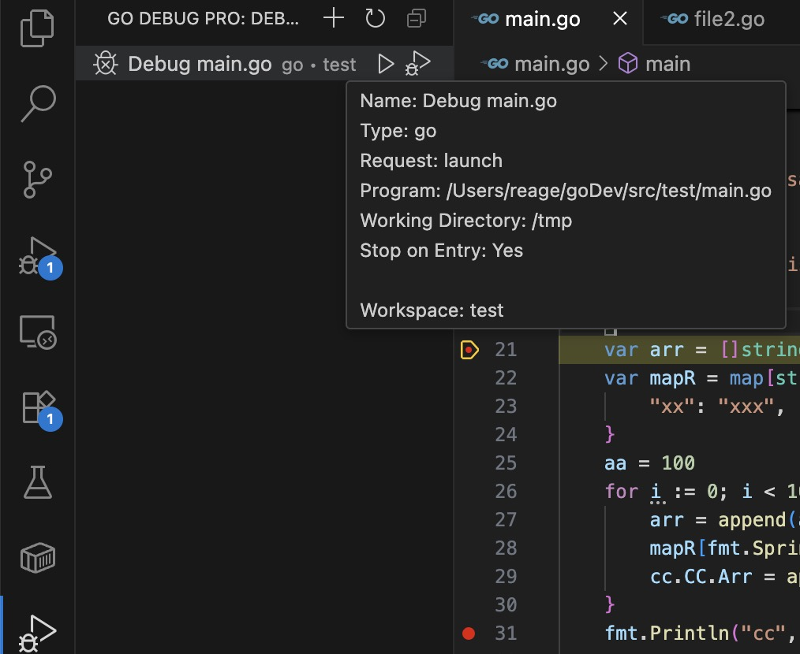
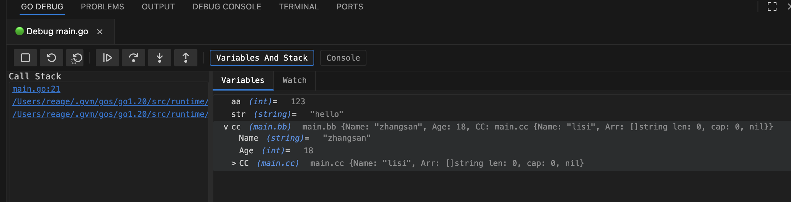
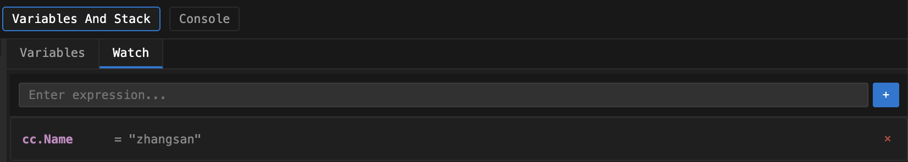

# Go Debug Pro

🚀 A powerful VS Code Golang debugging extension providing out-of-the-box functionality, aiming to deliver a professional-grade debugging experience similar to GoLand. Compatible with existing VS Code debug configurations.


A debug option tab is copied in the left workspace for managing run configurations, compatible with VS Code configurations.
Implements management and debug functions. Configuration items can be edited by clicking, run and debug appear on hover, right-click supports edit, run (debug), delete

A new output tab is added to the bottom workspace, responsible for console and debug.
Includes run/debug toolbar, console, debug (stack trace, variable, watch)



## 📋 Table of Contents

- [Key Features](#-key-features)
- [Quick Start](#-quick-start)
- [User Guide](#-user-guide)
- [Configuration Options](#️-configuration-options)
- [Project Architecture](#️-project-architecture)
- [Development](#️-development)
- [Troubleshooting](#-troubleshooting)
- [Contributing](#-contributing)
- [License](#-license)

## 📋 System Requirements

- **VS Code**: 1.85.0 or higher
- **Go**: 1.19 or higher
- **Delve**: Latest version (auto-detected or manually installed)
- **Platform**: macOS
- **Memory**: Recommended 4GB+ RAM

## ✨ Key Features

### 🎯 Smart Configuration Management
- **One-click Configuration Opening**: Click configuration items to directly open visual editor
- **Right-click Context Menu**: Copy configuration, delete configuration and other quick operations
- **Unified Menu Integration**: Clean up duplicate menus and provide a concise user interface
- **Command Palette Simplification**: Only show new configuration-related commands in command palette

### 🎨 Visual Configuration Editor
- **Graphical Interface**: Create and edit debugging configurations through visual interface without writing JSON
- **Real-time Preview**: Configuration changes display in real time, WYSIWYG
- **Template Support**: Multiple preset templates for quick creation of different types of configurations
- **Smart Validation**: Automatically validate configuration correctness to prevent configuration errors

### ⚡️ Advanced Debugging Features
- **Conditional Breakpoints**: Support expression-based conditional breakpoint setting
- **Hit Count Breakpoints**: Support breakpoints controlled by hit count
- **Real-time Variable Monitoring**: Watch expressions auto-refresh, real-time viewing of variable changes
- **Variable Editing**: Directly modify variable values in debug panel, supporting strings, numbers and other types
- **Complete Debug Support**: Full support for Call Stack, Threads, Variables
- **DAP Protocol**: Based on Debug Adapter Protocol to ensure debugging stability
- **Multi-session Management**: Support running multiple debugging configurations simultaneously
- **Context Menu**: Rich variable operation menu (copy, edit, watch, etc.)

### 📂 Project Structure Support
- **Multiple Run Modes**: Support single file, package, directory, module, workspace and other run modes
- **Smart Path Detection**: Auto-detect go.mod files and Go package structure
- **Workspace Management**: Unified management of debugging configurations for multiple workspaces
- **Tab Management**: Independent tabs for each debugging configuration, clear management of multiple debug sessions
- **Real-time Status Display**: Runtime status, duration and other information updated in real time

## 🚀 Quick Start

### Prerequisites

Make sure [Delve](https://github.com/go-delve/delve) debugger is installed:

```bash
go install github.com/go-delve/delve/cmd/dlv@latest
```

### Extension Installation

1. Search for "Go Debug Pro" in VS Code extension marketplace
2. Click install
3. Restart VS Code (if needed)

### Create Your First Debug Configuration

1. Press `Shift + Cmd + P` to open command palette
2. Search for "Create Configuration (Visual Editor)"
3. Select configuration type and fill in parameters
4. Save configuration to start debugging

## 📖 User Guide

### Configuration Management

#### Create New Configuration
- **Command Palette Method**: `Shift + Cmd + P` → "Create Configuration (Visual Editor)"
- **Panel Method**: Click "+" button in "Enhanced configuration" view in debug panel

#### Manage Existing Configurations
- **Click Configuration Item**: Directly open visual editor
- **Right-click Configuration Item**: Show operation menu (copy, delete, etc.)
- **Real-time Sync**: All changes automatically sync to `launch.json` file

### Debug Operations

#### Set Conditional Breakpoints
1. Right-click on code line
2. Select "Toggle Conditional Breakpoint"
3. Enter condition expression (e.g., `x > 5 && y != nil`)

#### Use Watch Expressions
1. Switch to "Variables And Stack" view during debugging
2. Click "Watch" tab
3. Enter expression (e.g., `user.Name`, `len(slice)`)
4. Click "+" button to add watch
5. Expression values will auto-refresh

#### Variable Operations
1. **View Variables**: View all local and global variables in Variables tab
2. **Edit Variable Values**: Click variable value to edit directly (supports strings, numbers, booleans)
3. **Context Menu**:
   - 📋 Copy variable name
   - 📄 Copy variable value
   - 📝 Copy expression
   - ✏️ Modify value
   - 👁️ Add to watch
   - 🔍 Inspect object

#### Call Stack Operations
- Click function names in call stack to jump to corresponding source code location
- Support call stack display for multi-threading and goroutines

## ⚙️ Configuration Options

### Extension Settings

Search for related configuration items in VS Code settings:

```json
{
    "go.delveConfig": {
        "dlvLoadConfig": {
            "followPointers": true,
            "maxVariableRecurse": 1,
            "maxStringLen": 200,
            "maxArrayValues": 100,
            "maxStructFields": -1
        },
        "apiVersion": 2,
        "stackTraceDepth": 50
    }
}
```

### Launch Configuration
```json
{
    "name": "Launch Go Program",
    "type": "go-debug-pro",
    "request": "launch",
    "mode": "debug",
    "program": "${workspaceFolder}/main.go",
    "cwd": "${workspaceFolder}",
    "env": {},
    "args": [],
    "stopOnEntry": false,
    "dlvFlags": ["--check-go-version=false"]
}
```

 

## 🏗️ Project Architecture

```
src/
├── extension.ts                     # Extension entry file, main activation logic
├── dap.ts                          # DAP protocol implementation, debug adapter
├── debugAdapter.ts                 # Debug Adapter core implementation
├── debugConfigProvider.ts          # Debug configuration tree view provider
├── configurationEditorProvider.ts  # Visual configuration editor
├── goDebugConfigurationProvider.ts # Go debug configuration provider
├── goDebugOutputProvider.ts        # Debug output panel provider
├── quickConfigurationProvider.ts   # Quick configuration provider
├── runConfigManager.ts             # Run configuration manager
├── globalStateManager.ts           # Global state manager
├── delveClient.ts                  # Delve debugger client
├── types/                          # TypeScript type definitions
│   ├── json-rpc2.d.ts
│   └── tree-kill.d.ts
└── utils/                          # Utility functions
    ├── envUtils.ts                 # Environment variable processing
    ├── pathUtils.ts                # Path processing utilities
    └── processUtils.ts             # Process management utilities
```

### Core Component Description

- **DAP (Debug Adapter Protocol)**: Implements standard debug adapter protocol
- **Configuration Management**: Supports visual configuration editing and automatic synchronization
- **State Management**: Unified management of debug sessions and configuration state
- **Output Panel**: Provides real-time debug information and log display
- **Delve Integration**: Seamless integration with Go official debugger

## 🛠️ Development

### Environment Setup
```bash
# Clone project
git clone <repository-url>
cd go-debug

# Install dependencies
npm install
```

### Development Commands
```bash
# Compile project
npm run compile

# Watch mode compilation
npm run watch

# Run tests
npm test

# Code linting
npm run lint

# Start development mode
npm run dev

# Build extension package
vsce package
```

### Debug Extension
1. Press `F5` to start extension development host
2. Test extension functionality in new window
3. Set breakpoints in original window to debug extension code

## 🐛 Troubleshooting

### Common Issues

1. **Delve Not Installed**
   ```bash
   go install github.com/go-delve/delve/cmd/dlv@latest
   ```

2. **Invalid Configuration**
   - Check if Go program path is correct
   - Confirm working directory settings
   - Verify environment variable configuration

3. **Breakpoints Not Working**
   - Ensure code is compiled and saved
   - Check if breakpoint line has executable code
   - Verify debugger connection status
   - Try clearing cache: `go clean -cache`

4. **Incomplete Variable Display**
   - Adjust `maxStringLen` setting
   - Use watch expressions to view specific parts
   - Check if variables are optimized by compiler

5. **Slow Debug Performance**
   - Reduce number of concurrent debug sessions
   - Avoid watching complex or large data structures
   - Set breakpoints appropriately, avoid frequent interruptions

### Debug Logging

Enable verbose logging to troubleshoot issues:
1. Open VS Code output panel
2. Select "Go Debug Pro" output channel
3. View detailed debug information and error logs

## 🤝 Contributing

We welcome contributions of any kind!

### Report Issues
- Use GitHub Issues to report bugs
- Provide detailed reproduction steps
- Include relevant error logs

### Submit Code
1. Fork the project
2. Create feature branch
3. Submit changes
4. Create Pull Request

### Development Standards
- Follow TypeScript coding standards
- Write unit tests
- Update relevant documentation

## 📄 License

This project is licensed under the [MIT License](LICENSE).

## 🙏 Acknowledgments

Thanks to the following projects and communities for their support:
- [Delve](https://github.com/go-delve/delve) - Go debugger
- [VS Code](https://code.visualstudio.com/) - Development environment
- [Go Community](https://golang.org/) - Language support

## 📊 Performance Features

- **Fast Startup**: Extension activation time < 100ms
- **Memory Optimized**: Runtime memory usage < 50MB
- **Concurrent Debugging**: Support running multiple debug sessions simultaneously
- **Caching Mechanism**: Smart configuration caching for improved response speed

## 🔄 Changelog

### v0.0.1 (Current Version)
- ✨ Initial release
- 🎯 Complete basic debugging functionality
- 🎨 Visual configuration editor
- 📊 Debug output panel
- 🔧 DAP protocol support

---

**Enjoy efficient Go debugging experience!** 🎉

> If you find this project helpful, please give us a ⭐️ Star!